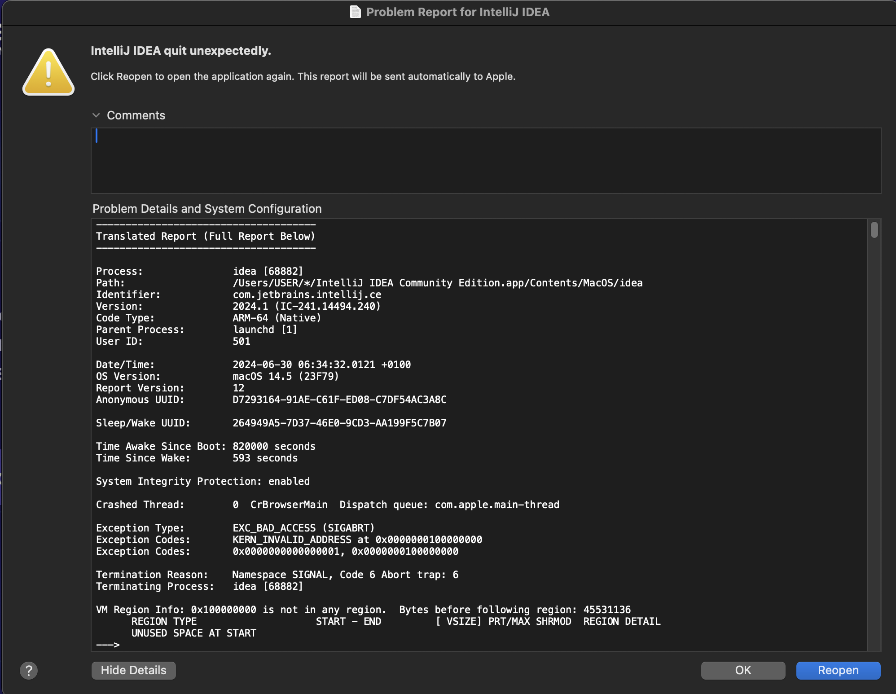

# IntelliJ 2024 Frequent Crashes

I have witnessed more crashes in the few months after updating IntelliJ to 2024 than I ever saw in all the years I have used it put together.

There are few things as annoying as being greeted with a Crash Report screen every few hours.
Image: 

I saw some suggestions on Stackoverflow, Reddit and Jetbrains Youtrack. Those that made sense suggested disabling Metal API for IntelliJ graphics rendering. I did so. You can set the JVM option for IntelliJ to disable it from: Help -> Edit Custom VM Options -> enter `-Dsun.java2d.metal=false`.

The application that had crashed twice before forcing me to look for a solution has not crashed again since yesterday, 30/06/24. Keeping my fingers crossed that no further actions would be required.

## Uncertainty

I am confused as to what happens now that Metal is disabled. Does IntelliJ fall back to OpenGL which is depracated on macOS 14? Is OpenGL even still bundled in macOS? Could it be using bare software rendering, CPU-based rendering, i.e. no GPU acceleration, that would be very bad. Given that I have not noticed any rendering performance detoriation I suspect that it defaults to OpenGL after disabling Metal. IntelliJ's interface is heavy and there would have been a noticeable drop in rendering speed if it were not using any GPU acceleration.

Checking available frameworks on macOS 14 shows there is OpenGL.

```bash
ls /System/Library/Frameworks | grep OpenGL
```

Checking the OpenGL version returns: `2.1 Metal - 88.1`. Therefore, I strongly suspect that when Metal is disabled on IntelliJ it uses OpenGL for rendering.  If it does not crash under me in the next one week, I am going to conclude that disabling Metal is a fix to these crashes :)
