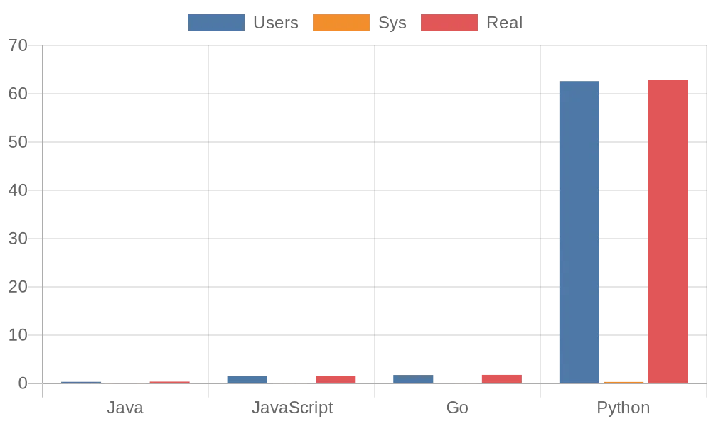
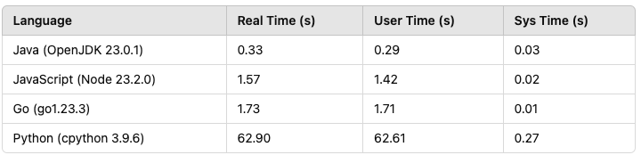
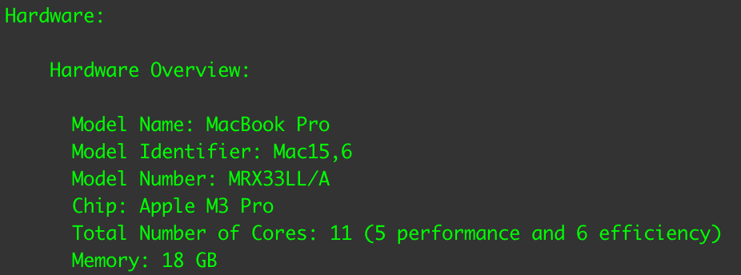

# A Billion Loop Iterations in Java, Js, Go and Python

I saw this thread on twitter where a guy tested the speed of 1 billion loop iterations in these four languages: JavaScript, Python, Go and C. See [thread here](https://x.com/BenjDicken/status/1857454195307356495)

Granted, the more fun thing would've been something similar to the [1brc](https://1brc.dev/) but this is just benchmarking language performance for a naive problem.

The author did not include Java so I did and ran the [benchmark](https://benjdd.com/loops/) on my machine.

## Results

## Machine Spec and Software Versions

Software versions:

- Java (OpenJDK 23.0.1)
- JavaScript (Node 23.2.0)
- Go (go1.23.3)
- Python (cpython 3.9.6)

I don't know if it is a cPython thing, but Python was incredibly slow. I eventually concluded it's something wrong with my computer just so I don't piss off the cPython community 😁