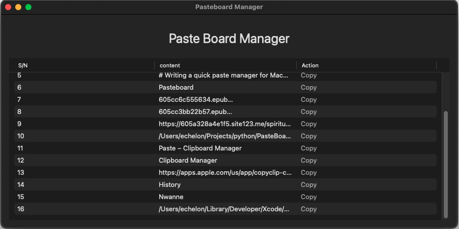

# Writing a quick paste manager for MacOs

First of all, XCode has to be the only IDE I have seen that does not bundle an interface to access the terminal. As though that is not enough it is not obvious how to copy a file path, I had to open files in Finder then copy their path. Even Zed that is just an editor has both a terminal and ability to copy file path.

Most personal software on my computer are CLI tools but I needed a GUI tool to help me manage pasteboard history. The lack of a proper pasteboard manager on MacOs can be frustrating. Whatever latest thing copied replaces the pasteboard content and there is no way to get previously copied texts. Not long ago my friends and I were complaining about it but yesterday I decided I had been frustrated enough to suspend everything and do a dirty fix.

I checked for existing solutions but most of them were too advanced and big (megabytes in file size) for my need and required payment. I only need a piece of software that checks the content of the system pasteboard, compares it against the last element in an array containing all previous copies since the app was launched. If the pasteboard content is different from the last item in the array, append it to the array. This process should happen every second. The contents of the array should be displayed on a table with a button to copy any item. Dead simple!

The data is all in memory, therefore no deletion for now, shutting down the app would do. Data persistence on a file might be added later. The implementation was straightforward but the app cannot be packaged for distribution without paying the Apple tax. Apple Developer membership is required which is $99.

The source code and the app archive (.app file) is hosted on Github until the Apple tax can be paid ;) If you come across this post and have any pointers to how I can enter MacOs underground club - those writing signed apps without paying any tax - please let me know.

Github Repo: [https://github.com/dipperLyra/tiny-pasteboard-manager](https://github.com/dipperLyra/tiny-pasteboard-manager)

This tiny app has banished my fear of overriding the pasteboard.

Image: 
